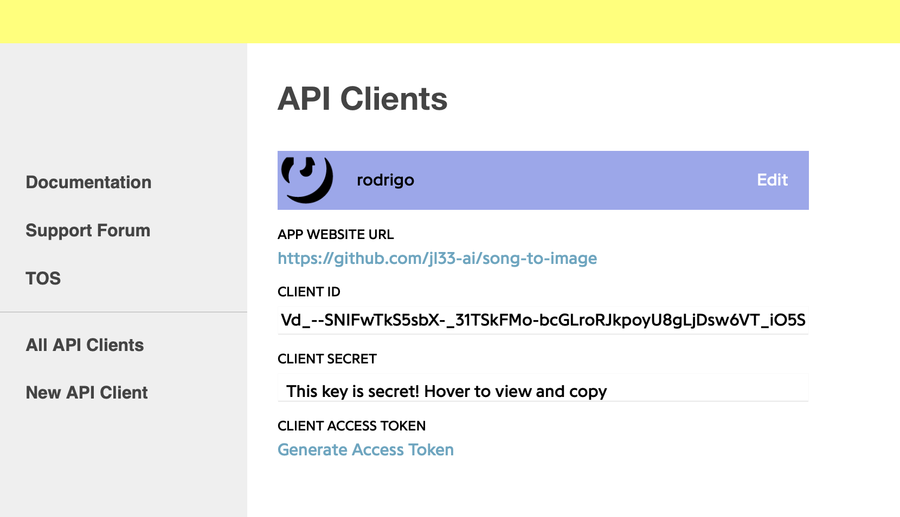

# song-to-image
*Each line of lyrics converted into an image using generative AI (chat + image)*

## How it Works

$$\text{Cost of one song} \approx \$2.50 \text{(A chocolate chip cookie)}$$

- [ ] Add sketch (in goes song title...)
- [ ] Add Link to YouTube Video (embedded)
- [ ] Insert screenshots & gifs

---

## Features 
– Estimated cost tracker
– "Enter a song"
- CSV of Json
- SHow the API costs
– use PIP to like add the actual lyric text to the thing… 
– go line by line w/ a loading bar and image emoji
– To get more bang for buck, pass through prompt optimiser (chatGPT) [show compariosn] [Sketch Flow]
– Each line of lyrics converted into an image using generative AI (chat + image)
- Automation

---

## End Goal / Motivation
- Started with a whacky YouTube video idea (my first good idea since (link stickman parkour)), and realised I’d need a python script to make it, a common realisation (link to girlfriend GPT)
- So end goal is a YouTube video... QUICK. NEED YOUTUBE CLOUT $$$

#### Also: 
– First large scale application. 
- First real practice of: 
    - Classes
    - argparse
    - **True modular programming**
    - OpenAI’s function-calling API
    - PIL

---

## The Pipeline
`ask user for song -> genius API -> parse lyrics w/ Beautiful soup -> convert into list of lines -> iterate through list -> for each line of lyrics -> pass to ChatGPT to get image prompt -> image prompt to image -> PIL to add text add text to an image? ``

---

## Requirements
- Genius API
– https://lyricsgenius.readthedocs.io
- 
- Tkinter
- DaVinci Resolve (to piece it together in the end)
- OpenAI
- 

## Difficulties and Learnings

```
raise self.handle_error_response(
openai.error.InvalidRequestError: Your request was rejected as a result of our safety system. Your prompt may contain text that is not allowed by our safety system.
```

